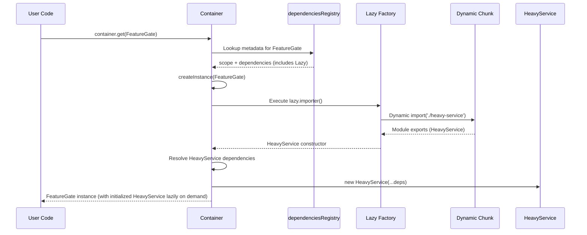
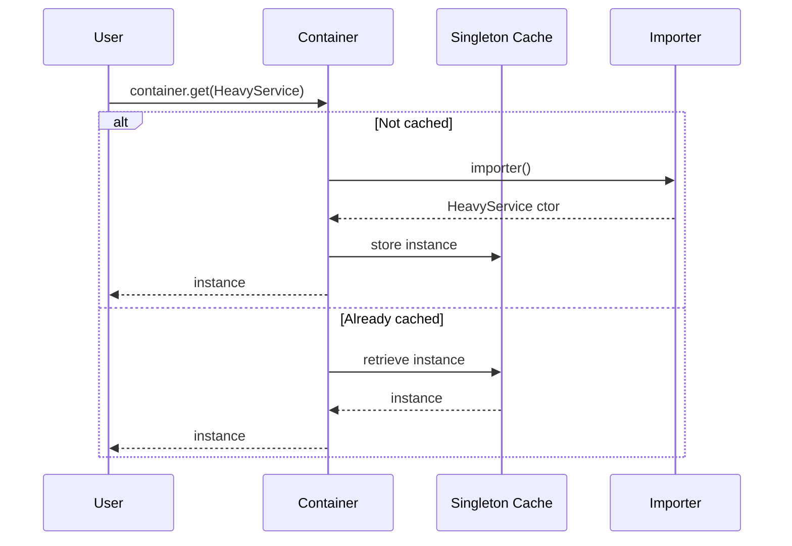

# Alloy Lazy Services

Alloy supports lazy loading of services to enable granular code splitting and defer expensive module initialization until they are actually needed. This works through:

1. Decorator-based lazy dependencies (`Lazy(() => import(...))` inside `@Injectable` / `@Singleton` dependency arrays).
2. Provider-based placeholders (`asLazyClass`) for external libraries.
3. Service-level factory laziness via the Vite plugin `lazyServices` option (adds a `factory: Lazy(...)` entry and omits static import of the service module).

Lazy services integrate with the DI system so they can:

- Participate in dependency graphs (other services can depend on them lazily)
- Respect lifecycle (singleton vs transient)
- Declare their own dependencies
- Retry dynamic imports with backoff semantics

---

## Core Building Blocks

| Concept                      | Purpose                                                                                                                       |
| ---------------------------- | ----------------------------------------------------------------------------------------------------------------------------- |
| `Lazy(importer, retry?)`     | Wraps dynamic `import()` for deferred resolution and optional retry/backoff.                                                  |
| Decorator dependencies       | `@Injectable([...Lazy(...)])` marks a dependency of a service as lazy.                                                        |
| Provider                     | `asLazyClass(() => import(...), { lifecycle, deps, label })` creates placeholder constructors for external modules.           |
| `lazyServices` plugin option | Marks whole services (by safe service identifiers) as factory-lazy; static import omitted; resolved via `factory: Lazy(...)`. |
| `dependenciesRegistry`       | Internal metadata; lazy providers & factory-lazy services attach `factory` used at runtime import.                            |
| `Container.importWithRetry`  | Executes dynamic import and optional retry strategy.                                                                          |
| Plugin codegen               | Filters lazy-only classes from eager imports; synthesizes stubs for factory-lazy services.                                    |

---

## Decorator-Based Lazy Dependency

```ts
import { Injectable, Lazy } from "alloy-di/runtime";
import type { HeavyService } from "./heavy-service"; // type-only import (optional)

@Injectable([Lazy(() => import("./heavy-service").then((m) => m.HeavyService))])
export class FeatureGate {
  constructor(private heavy: HeavyService) {}

  async activate() {
    // At first access, resolution triggers dynamic import of HeavyService chunk.
    await this.heavy.initialize();
  }
}
```

### How It Works

1. Source contains a `Lazy(() => import(...))` call inside the dependency array of `@Injectable`.
2. Alloy's Vite plugin AST pass (`processLazyCall`) detects the `Lazy` call shape and records a class key representing the referenced constructor.
3. During virtual module generation (`generateContainerModule`), any class key marked as lazy is **excluded** from static import statements, preventing eager bundling.
4. At runtime, when the container resolves `FeatureGate`, it encounters a lazy dependency and performs the dynamic import only then.

### Supported Dynamic Import Shapes

- `Lazy(() => import('./module').then(m => m.Service))`
- `Lazy(() => import('./service'))` (requires default export of a class)

If the plugin cannot statically analyze the importer (e.g., computed specifier), it will not mark the dependency as lazy-only; the module may be eagerly included.

---

## Provider-Based Lazy Service

Provider usage lets external libraries participate without Alloy decorators. The provider API introduces placeholders for lazily imported constructors.

```ts
// external-library/providers.ts
import { defineProviders, asLazyClass, lifecycle } from "alloy-di/runtime";

export default defineProviders({
  lazyServices: [
    asLazyClass(() => import("./heavy-service").then((m) => m.HeavyService), {
      lifecycle: lifecycle.singleton(),
      deps: [
        /* other dependencies of HeavyService */
      ],
      label: "HeavyService",
    }),
  ],
});
```

Providers can also register eager services and values alongside lazy services. In consumer apps, the Vite plugin imports provider modules from both local config (`providers: [...]`) and manifests emitted by internal libraries, then calls `applyProviders(container, ...)` after decorator-based registrations. If the same class name is discovered locally and also provided via manifest, the plugin throws a duplicate-registration error to prevent ambiguous DI keys.

In consumer code you simply ensure the provider module is included in the build so the plugin can apply it. The virtual container module will import your provider file and call `applyProviders`, seeding the registry with lazy metadata.

### Placeholder Mechanics

`asLazyClass` creates an **uninstantiable placeholder constructor**. Attempts to `new` it throw an error. A hidden symbol property contains the descriptor with:

- Lifecycle (`singleton` / `transient`)
- Dependency thunk
- Lazy factory referencing the dynamic import

The placeholder identity is used as the DI key so singleton caching and dependency declarations behave exactly like real classes.

---

## Service-Level Factory Laziness (Plugin `lazyServices`)

Add a `ServiceIdentifier` symbol to the plugin config to lazily import the **service itself**, not just its dependencies.

```ts
// vite.config.ts
import { alloy } from "alloy-di/vite";
import { serviceIdentifiers } from "./src/virtual-container";

export default defineConfig({
  plugins: [
    alloy({
      lazyServices: [serviceIdentifiers.ReportingService],
    }),
  ],
});
```

Effects:

1. Static import of `ReportingService` is omitted in the virtual container module.
2. A stub `class ReportingService {}` is generated as the DI key.
3. Registration metadata includes `factory: Lazy(() => import('/abs-or-specifier').then(m => m.ReportingService))`.
4. First `container.get(serviceIdentifiers.ReportingService)` triggers dynamic import.

Attempting to resolve a factory-lazy service by its constructor inside a browser bundle now triggers a development warning, since that pattern risks pulling the implementation into the eager chunk. Use type-only imports (e.g., `import type { ReportingService } ...`) if you still need constructor types for other purposes.

Or, using identifier-based retrieval if you only need the instance:

```ts
import container, { serviceIdentifiers } from "virtual:alloy-container";

const reportingServicePromise = container.get(
  serviceIdentifiers.ReportingService,
);
```

This identifier-based call path keeps the implementation lazily imported and suppresses the constructor warning, which makes it the recommended approach for any factory-lazy service consumed by client code.

Combine with `import type { ReportingService } from '@scope/internal-lib';` for type safety without eager code.

### When to Prefer `lazyServices`

| Scenario                     | Decorator Lazy | Provider Lazy    | `lazyServices`            |
| ---------------------------- | -------------- | ---------------- | ------------------------- |
| Defer only a dependency      | ✅             | ✅               | ❌                        |
| Library outside your control | ❌             | ✅               | ✅ (if identifier stable) |
| Defer entire service module  | ❌             | ✅ (placeholder) | ✅                        |
| Avoid adding provider file   | ✅             | ❌               | ✅                        |

### Limitations

- Service identifier must be stable and unique across scanned sources.
- Does not (yet) support pattern matching (exact symbols only).
- Tree-shaking relies on bundler recognizing absence of static import; dynamic import chunking must be supported by build config.

## Runtime Resolution Flow (Decorator / Provider / Factory-Lazy)



### Singleton Resolution Path



---

## Retry & Backoff

`Lazy(importer, { retries, backoffMs, factor })` enables resilient loading for flaky or delayed chunks.

Retry algorithm (simplified):

1. Attempt import.
2. On failure and remaining retries > 0: wait `backoffMs * factor^attemptIndex` then retry.
3. Throw aggregated error (with original cause) after final failure.

```ts
const ResilientService = Lazy(
  () => import("./resilient").then((m) => m.ResilientService),
  { retries: 3, backoffMs: 200, factor: 2 },
);
```

---

## Dependency Declaration Strategies

| Strategy                | Use Case                                         | Notes                                       |
| ----------------------- | ------------------------------------------------ | ------------------------------------------- |
| Array literal           | Simple, static dependencies                      | `@Injectable([ServiceA, Lazy(...), token])` |
| Thunk (`() => [ ... ]`) | Circular or order-sensitive deps                 | Supported by provider API via `deps` option |
| Provider `deps`         | External modules needing dynamic or late binding | Normalized into a thunk internally          |

Circular dependencies are detected by resolution stack tracking; a lazy boundary does **not** automatically break cycles if two services directly require each other.

---

## Code Splitting Guarantees

The Vite/Rollup plugin guarantees a lazy-marked class is not statically imported when:

1. The `Lazy` call structure matches one of the analyzable patterns.
2. The referenced class does not appear eagerly elsewhere.
3. Provider placeholder metadata is applied (for provider scenario).

If any condition fails, the class may be eagerly included—still functional but not split.

---

## Error Cases

| Scenario                              | Error Message                                                | Mitigation                                              |
| ------------------------------------- | ------------------------------------------------------------ | ------------------------------------------------------- |
| Instantiating placeholder directly    | "Lazy provider placeholders cannot be instantiated directly" | Always use `container.get`                              |
| Lazy importer returns non-constructor | "Lazy importer did not return a class"                       | Ensure module exports a class (default or named)        |
| Token missing value provider          | "No provider registered for token ..."                       | Register via `container.provideValue` or value provider |
| Import retry exhausted                | "Failed to import lazy dependency ..."                       | Increase `retries` or verify chunk path                 |

---

## Choosing Between Decorators, Providers, and Factory-Lazy

| Approach   | When to Prefer                                     |                                             |
| ---------- | -------------------------------------------------- | ------------------------------------------- |
| Decorators | Internal code under your control; simpler syntax   | Minimal config, automatic scanning          |
| Providers  | External libraries or frameworks you cannot modify | No decorator requirement, can attach labels |
| Mixed      | Monorepo with both internal and external services  | Both interoperable; single container graph  |

---

## Advanced Usage Examples

### Lazy Transient Service via Provider

```ts
export default defineProviders({
  lazyServices: [
    asLazyClass(() => import("./Ephemeral").then((m) => m.Ephemeral), {
      lifecycle: lifecycle.transient(),
      deps: () => [
        /* dynamic dep resolution */
      ],
    }),
  ],
});
```

The service is imported every time it is requested (unless the module itself caches internal state).

### Lazy With Default Export

```ts
@Injectable([
  Lazy(() => import("./default-export-service")), // expects default export class
])
export class UsesDefaultExportService {
  constructor(private svc: DefaultExportService) {}
}
```

---

## Internal Implementation Highlights

| File                    | Responsibility                                              |
| ----------------------- | ----------------------------------------------------------- |
| `src/lazy.ts`           | Defines `Lazy` wrapper and retry options                    |
| `src/plugin/lazy.ts`    | AST traversal & class key extraction                        |
| `src/plugin/codegen.ts` | Filters lazy class keys from eager imports                  |
| `src/providers.ts`      | Placeholder creation (`asLazyClass`) & provider application |
| `src/container.ts`      | Runtime resolution, retry logic, singleton caching          |

The hidden symbol `LAZY_PROVIDER_DESCRIPTOR` in `providers.ts` ensures metadata remains non-enumerable and avoids name collisions.

---

## Migration Tips

- Convert an existing eagerly injected dependency to lazy by replacing direct constructor reference with `Lazy(() => import(...))`.
- External library service? Move its registration to a provider file using `asLazyClass` instead of adding decorators.
- Need resilience? Add retry options while wrapping the import.

---

## Quick Reference

```ts
// Decorator form
@Injectable([Lazy(() => import("./svc").then((m) => m.Svc))])
export class Consumer {
  constructor(private svc: Svc) {}
}

// Provider form
export default defineProviders({
  lazyServices: [
    asLazyClass(() => import("./svc").then((m) => m.Svc), {
      lifecycle: lifecycle.singleton(),
      deps: [],
      label: "Svc",
    }),
  ],
});
```

---

## FAQ

**Q: Can I lazy-load a value provider?**  
A: Values are typically small; wrap a factory returning a class instead if cost is high. Lazy value factories are not currently first-class.

**Q: Do retries apply to provider placeholders?**  
A: Yes. The underlying `Lazy` wrapper supports retry across both decorator and provider usages.

**Q: Can I mix lazy and eager dependencies for the same service?**  
A: Yes. Only the specifically wrapped dependencies are deferred.

**Q: How do I profile lazy import timing?**  
A: Add logging inside the dynamic import chain or wrap `Lazy` with a timing decorator before returning the module.

---
