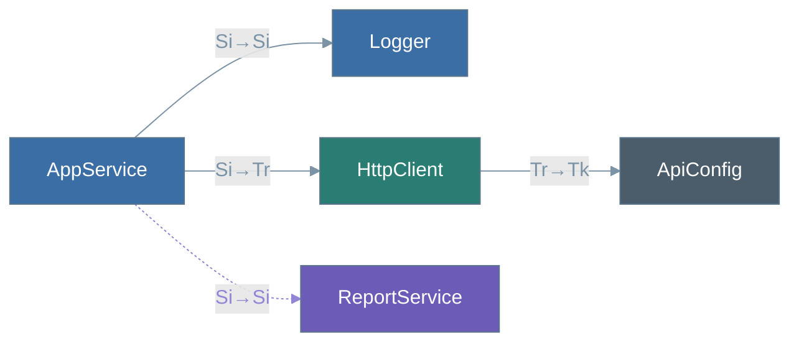

# Dependency Graph Visualization

Because Alloy resolves your container at **build time**, it knows the entire
dependency graph — every service, how it's registered, and how each one wires to
the next. It can emit that graph as a [Mermaid](https://mermaid.js.org/) diagram
so you can _see_ your container instead of reasoning about it from scattered
decorators.

The diagram below is what Alloy produces for a small container:



At a glance you can read the **lifecycle** of every node, whether a dependency is
**eager or lazy**, and where unresolved **tokens** enter the graph.

## Enabling it

Set the [`visualize`](/config/vite-plugin#visualize) option on the plugin. Alloy
regenerates the artifact every time the container changes — during `vite dev`
(on HMR) and on `vite build`.

```ts
// vite.config.ts
import { defineConfig } from "vite";
import { alloy } from "alloy-di/vite";

export default defineConfig({
  plugins: [
    // Writes ./alloy-di.mmd with the default styling.
    alloy({ visualize: true }),
  ],
});
```

Pass an object to control the output path, direction, or colors:

```ts
alloy({
  visualize: {
    mermaid: {
      outputPath: "./docs/di-graph.mmd",
      direction: "TB", // LR (default) · TB · BT · RL
      includeLegend: true,
    },
  },
});
```

See the [`visualize` reference](/config/vite-plugin#visualize) for the full list
of style overrides (`scopeColors`, `lazyNodeFill`, `eagerEdgeColor`, and more).

## Reading the diagram

### Nodes

Each node is filled according to **how it's registered** in the container. The
checks are applied in order, so a factory-backed or lazy-only service keeps its
distinct color even if it also has a scope.

| Fill       | Default   | Meaning                                                                                     |
| ---------- | --------- | ------------------------------------------------------------------------------------------- |
| Steel-blue | `#3b6ea5` | **Singleton** service                                                                       |
| Teal       | `#2a7d73` | **Transient** service                                                                       |
| Violet     | `#6c5cb8` | **Lazy-only** service (reachable solely via `Lazy()`)                                       |
| Bronze     | `#9c6516` | **Factory** — a factory-lazy service or a [factory provider](/guide/factory-providers) node |
| Slate      | `#4b5c6b` | **Token** — an identifier with no resolved provider                                         |

#### Factory provider nodes

A token bound to a [factory provider](/guide/factory-providers) (`asFactory` /
`provideFactory`) renders as its own Bronze node labelled `Factory: <token>`,
distinct from auto-discovered classes because the factory body is opaque to the
scanner. A service that depends on a factory-bound token draws its edge to this
node instead of a plain token node, and — because a factory carries a
lifecycle — that edge is scope-stability checked: a longer-lived service
depending on a shorter-lived scoped factory is flagged as a captive dependency,
just as it would be for a class.

### Edges

Edges point from a service to each of its dependencies. The **arrow style** tells
you how the dependency is wired:

- **Solid steel arrow** (`-->`) — an **eager** dependency, injected at construction.
- **Dotted violet arrow** (`-.->`) — a **lazy** dependency, deferred behind `Lazy()` and code-split.

Each edge carries a compact **`source→target` scope** label so you can read the
lifecycle transition without tracing colors:

| Code | Scope     |
| ---- | --------- |
| `Si` | singleton |
| `Tr` | transient |
| `Tk` | token     |

For example, `Si→Tr` is a singleton depending on a transient. The dependency's
eager/lazy nature is shown by the arrow style and the target's kind by its node
color, so the label stays short.

## Rendering the `.mmd` file

The generated file is plain Mermaid text, so you can render it almost anywhere:

- **GitHub / GitLab** — paste the contents into a fenced ` ```mermaid ` block in any Markdown file; both render it natively.
- **VS Code** — the [Markdown Preview Mermaid Support](https://marketplace.visualstudio.com/items?itemName=bierner.markdown-mermaid) extension previews `.mmd` files.
- **Browser** — paste it into the [Mermaid Live Editor](https://mermaid.live).
- **CLI / CI** — export to SVG or PNG with [`@mermaid-js/mermaid-cli`](https://github.com/mermaid-js/mermaid-cli):

  ```bash
  npx @mermaid-js/mermaid-cli -i alloy-di.mmd -o di-graph.svg
  ```

> [!TIP]
> Commit the `.mmd` (or a rendered SVG) and your dependency graph becomes a
> reviewable artifact — diffs show exactly when a service changes lifecycle,
> gains a dependency, or switches between eager and lazy wiring.
