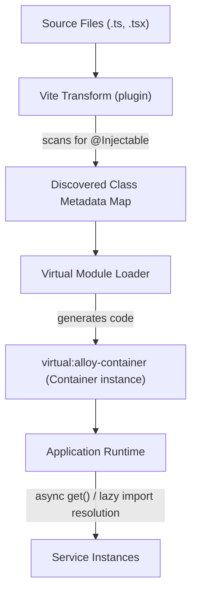

# What is Alloy?

Alloy is a Vite plugin for **compile-time dependency injection**.

It scans your code at build time to build a dependency graph and generates a DI container, which is then available to your application as a virtual module. This approach minimizes runtime overhead, avoids `reflect-metadata`, and provides a clean, declarative API for managing your services.

## Why Alloy?

Most TypeScript DI frameworks configure the container **at runtime**. They resolve the graph while your app runs, usually lean on `reflect-metadata` (a global polyfill plus `emitDecoratorMetadata`), and only surface wiring mistakes when a code path is first hit.

Alloy moves that work to **build time**. The plugin reads your `@Injectable` classes, constructs the dependency graph during the build, and generates the container as code. That shift produces properties runtime containers can't easily match:

- **Errors surface at build time, not in production.** Circular dependencies and duplicate registrations fail the build — not a request three weeks later.
- **Zero runtime reflection.** No `reflect-metadata`, no `emitDecoratorMetadata`, no global polyfill — yet services are still discovered automatically, not hand-registered one by one.
- **Bundler-native lazy loading.** `Lazy(() => import('./Heavy'))` makes a dependency a real dynamic-import boundary, so your DI graph and your bundler's chunk graph are the same graph. DI participates in code-splitting instead of fighting it.
- **A minimal, tree-shakeable runtime.** The generated container is little more than a map of factories; opt-in features drop out entirely when unused.
- **Type safety without magic.** Dependencies are declared as strongly-typed tuples and checked against constructors at compile time, and generated `ServiceIdentifier`s stay stable across minification and code-splitting.
- **A visible graph.** Because the graph is known at build time, Alloy can emit a [Mermaid diagram](/guide/visualization) of your services.

The trade-off is that Alloy is a **build-time tool**: it relies on the Vite (or Rollup) plugin and resolves asynchronously to support lazy imports. In exchange you get safety and bundle-awareness that runtime containers fundamentally can't offer.

## High-Level Architecture

